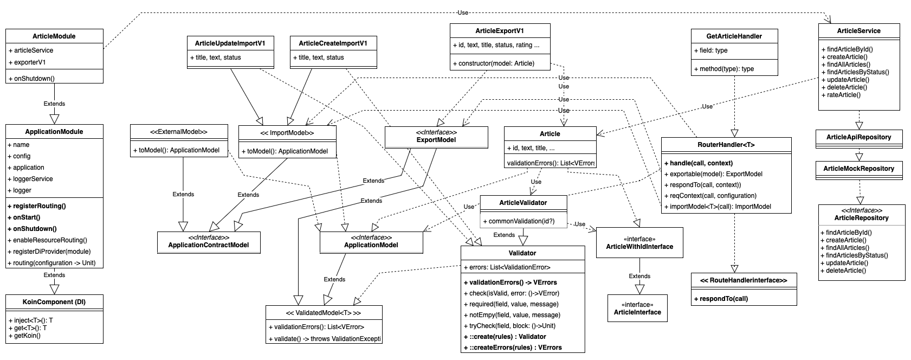

# DK Ktor Starterpack for real-world API development for Kotlin

Production ready , and easy to use starterpack for Ktor API development. It has Sensible feature set which every large-scale (or quality)  application should have.

The source code can also serve as learning material. It's build with personal know-how and experience collected during development in `PHP + Laravel`, `Typescript + express`, `C# + Unity3D`, `Swift iOs Apps`. and more..

It is designed with large-scale applications in mind.

I hope it helps you! Feel free leave feedback or your ideas (Code review appreciated).

## Main focus:
- Modern (y2023) - Kotlin & Ktor based, using kotlin advanced features
- Best practices - Domain Driven Design, Clean Architecture, SOLID, KISS, YAGNI, DRY
- Simplicity - Clarity, Obviousness, No-Magic, No-annotations, NO-unnecessary features,
- Easy-to-use - (preconfigured, extendable, DI, config (support .env), logging, example REST included)
- Modular Approach -
    - every module is self-contained (single folder) and can be used independently
    - Loose coupling
    - wn Routing, Dependency Injection, Services etc..
- Production Ready
    - it is suited for small and large projects
    - Performance (Ktor, Kotlin, Coroutines, EventLoop)
    - Docker, Kubernetes, Helm, CI/CD, Monitoring, Logging, Metrics, etc..

## Technology stack:
- Kotlin
- Ktor (framework)
- Koin (DI library)
- Logback (Logging configured for ELK (Kibana, Logstash))
- dotenv `.env`
- Swagger UI (exposed API Documentation )
- JUnit5
- Docker
- Gradle
- Prometheus
- REST API

## Design


## Running

 ```bash
 sh gradlew run
 ```

## Running with auto-reload

!!! IMPORTANT !!!
auto-reload feature - which broke singletons!
@see [stackOverflow](https://stackoverflow.com/questions/75007189/kotlin-ktor-singleton-doesnt-work-in-development-mode-auto-reload-enabled)

set `.env` file or ENV variable

```bash
ENVIRONMENT=development
```

Since Auto-reload detects changes in output files, we need to enable automatic project rebuilding. To do this, execute
the following command in a repository's root directory:

```bash
sh gradlew -t build
```

Follow the steps below to see Auto-reload in action:

1. Open another terminal tab and run a sample:
   ```bash
   sh gradlew run
   ```
1. Open [http://localhost:8080/](http://localhost:8080/) to see a sample text in a browser.
1. Change a text passed to the  `respondText` method in [Application.kt](src/main/kotlin/com/example/Application.kt) and
   save a file.
1. Refresh the [http://localhost:8080/](http://localhost:8080/) page to see the updated text.

## Configuration

see `.env.sample` file

## Features

- [x] [Ktor](https://ktor.io/) framework
- [x] Configuration using .env file
- [x] Dependency Injection [Koin](https://insert-koin.io/)
  - [ ] should we use Eager initialization? 
- [x] App structure (Modules)
- [x] Logging  [configure runtime](https://stackoverflow.com/questions/16910955/programmatically-configure-logback-appender)
  - [x] LoggerService
  - [ ] !!!separated LoggerContext
  - [ ] Check if all logs are compatible with ELK (fe: mal-disc-repo)
  - [x] Scoped logger per request (meta data userId, shopId, etc) @see ReqContext.kt
  - [x] MethodCalled meta
  - [x] Request logging with correct scope and loggerName
- [ ] Error Handling
  - [x] Global handling of NotFoundException, RequestValidationException, BadRequestException, IllegalArgumentException, etc 
- [x] Monitoring
  - [x] `/metrics` endpoint (prometheus)
    - [] Metrics correct names and units (don't know how...it looks like its impossible) https://www.robustperception.io/who-wants-seconds/ 
    - [x] `/health` Health Check
- [!!!] serialization
- [x] Validation
  - [x] Request & Internal & Response Validation
  - [x] Custom solution - KTOR RequestValidationPlugin is just not good enough
  - [x] Validation with nice error messages @see [ValidationException]
  - [x] Extendable validation
- [ ] Testing
  - [ ] Testing EP with snapshots
  - [ ] Example module test (ArticleModule)
- [ ] Deployment
  - [ ] Docker
  - [ ] gitlab-ci
  - [ ] k8s
- [ ] Example module (Articles)
  - [x] Routing (Resource Controller)
  - [x] Repository
  - [x] Service
  - [x] Model
  - [x] ModelExporter (versioned JSON export)
  - [ ] Tests
  - [x] Request & Response validation
  - [x] RequestContext (contextual logger and metadata) @see `plugins/RequestContext.kt`
- [x] Root ApiInfo endpoint `/` (version, build, swagger, urls, etc)
- [x] Graceful shutdown
- [x] Swagger
  - [x] serve swagger.yml `/swagger/swagger.yml`
  - [x] swagger-ui `/swagger`

## Known issues
- [x] Auto-reload feature - which broke singletons! [KTOR-4842](https://youtrack.jetbrains.com/issue/KTOR-4842/Autoreloading-It-breaks-lateinit-variables-initialization)
  - if singleton is created inside Application module, it will be created only once (on first request) and KtorAutoLoader should don't release instance
  - in development mode, it is not problem i guess... (only Singleton which is created outside of module is Config...)
- [ ] Logger shared context - Not working properly (context should be owned by every child)
- [ ] CallLogging sets custom logger (app.router) - but it is used by KTOR system logging...  
- [ ] Serializer for LogLevel doesn't work @see `/lib/serializers/LogLevelSerializer.kt`"
- [ ] Metrics are in default second units (prometheus default) - im was unable to change it to milliseconds
   - [maybe its intentional and it can't be changed](https://www.robustperception.io/who-wants-seconds/)
   - we can maybe try Dropwizard instead of Micrometer
- [ ] Resource param validation weirdness (KTOR)
  - if http://0.0.0.0:3000/v1/articles?status=NEEXISTUJE  
  -  first time i have correct 400 BadRequest:  `cz.danielkouba.ktorStarterpackDk.modules.article.model.ArticleStatus does not contain element with name 'PUBLISHEDs'`
  -  second time i have wierd  400 BadRequest: `io.ktor.server.plugins.BadRequestException: Can't transform call to resource`
  - solvable with custom validation (don't use any Enums as types)
  
```
  ____     __  __        __  __     ______   ______     ______
/\  __-.  /\ \/ /       /\ \/ /    /\__  _\ /\  __ \   /\  == \
\ \ \/\ \ \ \  _"-.     \ \  _"-.  \/_/\ \/ \ \ \/\ \  \ \  __<
 \ \____-  \ \_\ \_\     \ \_\ \_\    \ \_\  \ \_____\  \ \_\ \_\
  \/____/   \/_/\/_/      \/_/\/_/     \/_/   \/_____/   \/_/ /_/
    GINGER BEAVERS          STARTERPACK FOR KOTLIN KTOR SERVERS 
```
